<!-- _class: lead -->
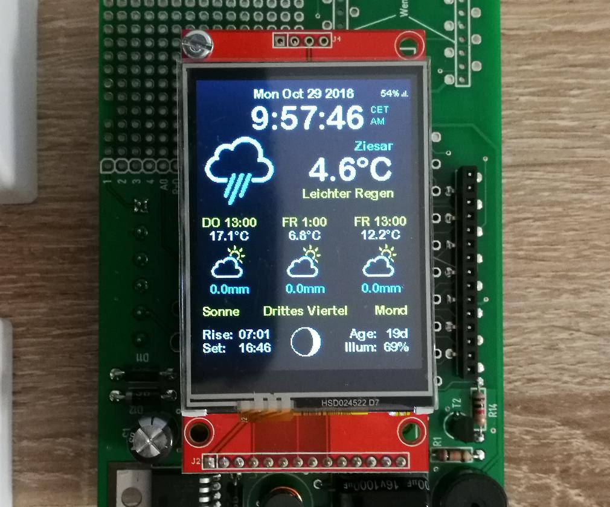

# Smarty Weather Station
## An IoT environmental monitoring system

**Presenter:** Patrick Marsden  
**Course:** ELET2415

---

# Problem And Objective

- Many low-cost weather builds stop at raw sensor output and do not support remote monitoring
- A practical system must collect data, move it wirelessly, store it, and present it clearly
- This project was designed as a complete **sensor-to-dashboard IoT pipeline**

**Main objective**

- Measure environmental conditions in real time and make them visible on a **wireless local display** and a **web dashboard**

---

# System Overview

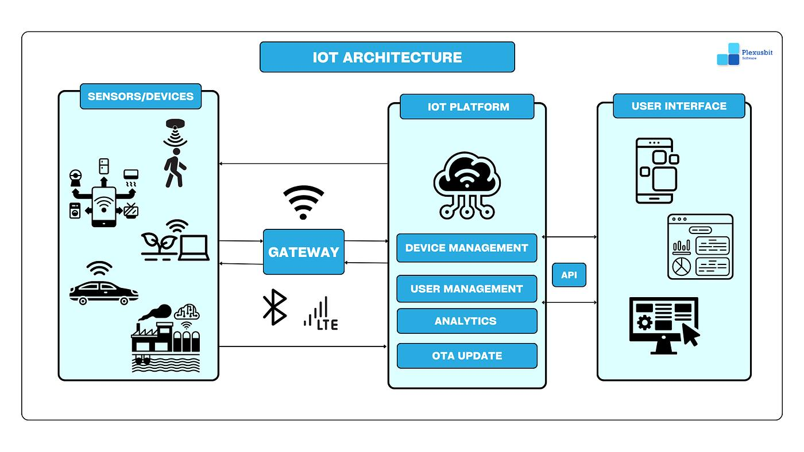

<p class="note">Data flow: Sensors -> Sensor ESP32 -> ESP-NOW -> Gateway ESP32 -> Wi-Fi/HTTP -> Flask backend -> MongoDB -> Vue dashboard</p>

---

# Data Flow Diagram

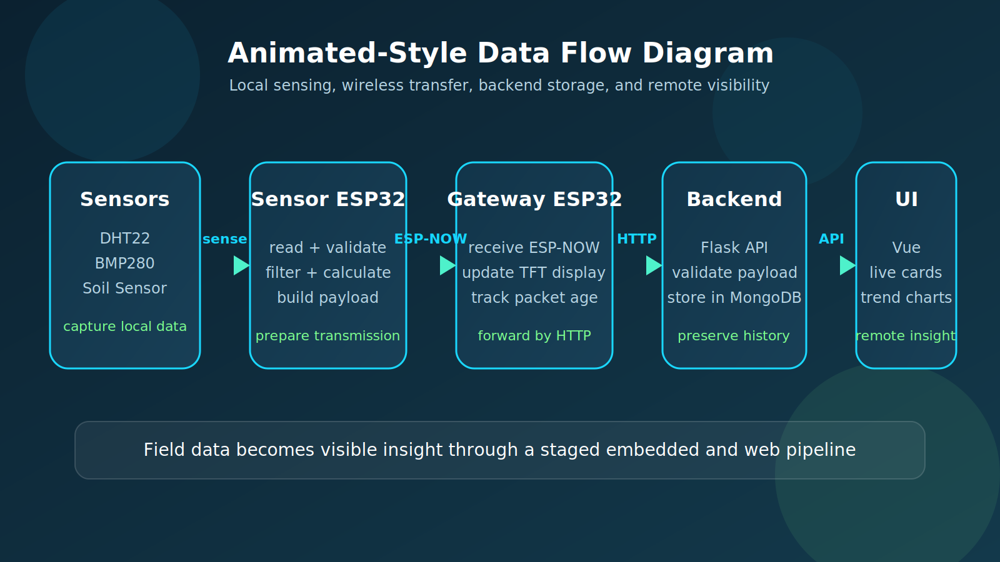

---

# Hardware Design And Wiring

<div class="split">
<div>

- **ESP32** selected for Wi-Fi, ESP-NOW, ADC, and flexible GPIO
- **DHT22** measures temperature and humidity
- **BMP280** measures pressure and supports altitude estimation
- **Soil sensor** adds plant-monitoring value
- **TFT display** provides a local interface without opening a browser

<p class="note">Key interfaces: DHT22 on GPIO 4, BMP280 on I2C GPIO 21/22, soil sensor on ADC GPIO 34.</p>

</div>
<div>

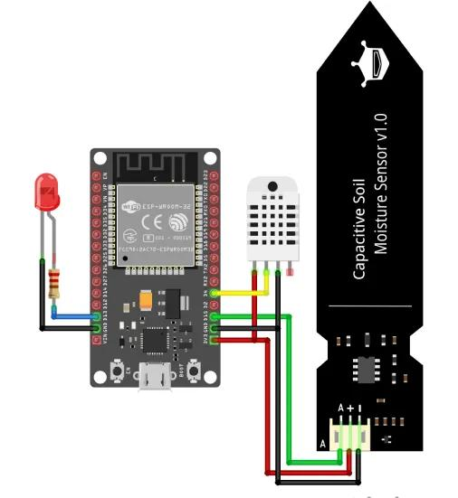

</div>
</div>

---

# PCB / Wiring Diagram

<div class="split">
<div>

- This slide is important because **ELET2415 expects the hardware interconnections to be explained clearly**
- The PCB/schematic view shows the logic of the circuit: power, ESP32, and sensor paths
- The wiring view shows the practical test connections used to prove the system

**Explain these links clearly**

- DHT22 on a digital GPIO line
- BMP280 on the `I2C` bus using `SDA` and `SCL`
- Soil moisture on an `ADC` input
- regulated power feeding the ESP32 and attached modules

</div>
<div>

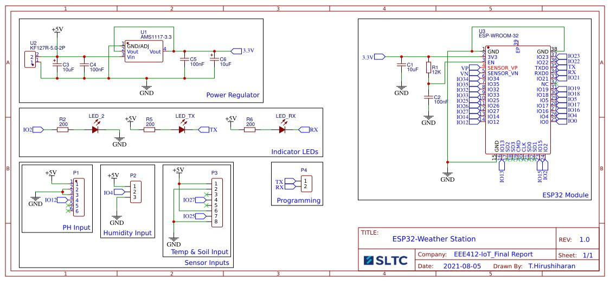

</div>
</div>

<p class="note">Use this slide to distinguish between a circuit-level schematic and the physical wiring arrangement used during testing and integration.</p>

---

# Prototype And Diagram References

<div class="gallery-quad-wide">
<div>


<p>Prototype hardware photo showing the local display hardware context.</p>

</div>
<div>

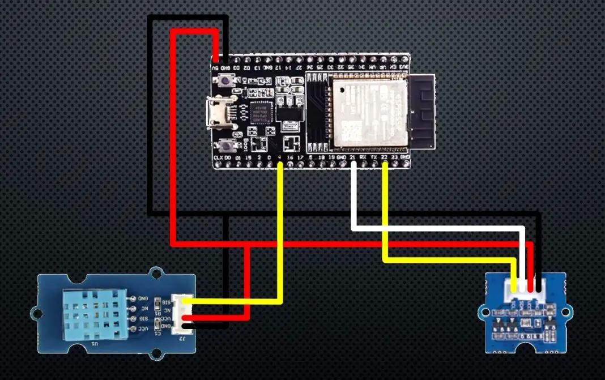
<p>Reference image showing ESP32 connections to environmental sensors.</p>

</div>
<div>


<p>Reference image showing ESP32, DHT sensor, and capacitive soil sensor wiring.</p>

</div>
<div>


<p>Reference schematic showing the ESP32 module, programming header, and support circuitry.</p>

</div>
</div>

---

# Why ESP-NOW And Why Two ESP32s?

<div class="reason-grid">
<div>

### Why ESP-NOW?

- low latency board-to-board communication
- no router required between the sensing node and the display node
- efficient for short local IoT payloads
- well suited to a wireless display demonstration

</div>
<div>

### Why two ESP32s?

- separation of sensing and gateway responsibilities
- easier placement of sensors at the measurement point
- the second board becomes a **wireless display**
- clearer modular design for testing and expansion

</div>
</div>

---

# System Flow

<div class="step-grid">
<div>

### Sense

<ul>
<li>read DHT22, BMP280, and soil sensor</li>
<li>sample on a timed update cycle</li>
</ul>

<p>Capture the raw environmental data.</p>

</div>
<div>

### Validate

<ul>
<li>check sensor ranges</li>
<li>retry failed reads</li>
<li>calculate heat index and soil percentage</li>
</ul>

<p>Make the readings stable and usable.</p>

</div>
<div>

### Transmit

<ul>
<li>send payload by ESP-NOW</li>
<li>update the TFT gateway display</li>
<li>forward to Flask by HTTP</li>
</ul>

<p>Move the data from the field to the platform.</p>

</div>
<div>

### Store

<ul>
<li>validate again in Flask</li>
<li>timestamp and save in MongoDB</li>
<li>serve it to the dashboard</li>
</ul>

<p>Preserve the data for monitoring and analysis.</p>

</div>
</div>

---

# Wireless Display Experience

<div class="split">
<div>

- The display is not tied to the sensors by wiring; it receives live readings wirelessly
- The interface supports swiping between **Dashboard**, **Weather**, **Soil**, and **System**
- It exposes packet age, Wi-Fi state, sensor flags, and system status in real time
- That makes the local display a key innovation, not just an output screen

</div>
<div>

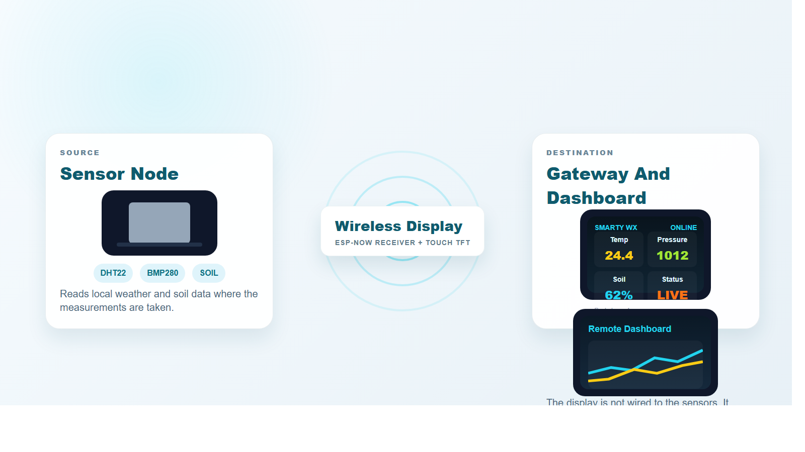

</div>
</div>

---

# Backend And Data Storage

<div class="split-tight">
<div>

- Main update route: `POST /api/weather/update`
- Other routes support latest data, recent history, analysis, control, and system status
- Flask validates the payload, converts values, timestamps the record, and stores it in MongoDB

**Example document**

```json
{
  "temperature": 28.5,
  "humidity": 55.0,
  "heatIndex": 29.8,
  "pressure": 1012.5,
  "altitude": 145.2,
  "soilMoisturePercent": 48,
  "timestamp": "server-generated"
}
```

</div>
<div>

<div class="flow-box">

**Why the backend matters**

- preserves history
- supports remote access
- enables charts and analysis
- turns a sensor build into a complete IoT system

</div>

</div>
</div>

---

# Frontend Dashboard

<div class="label-gallery">
<div class="label-card">

### Live Metrics Cards

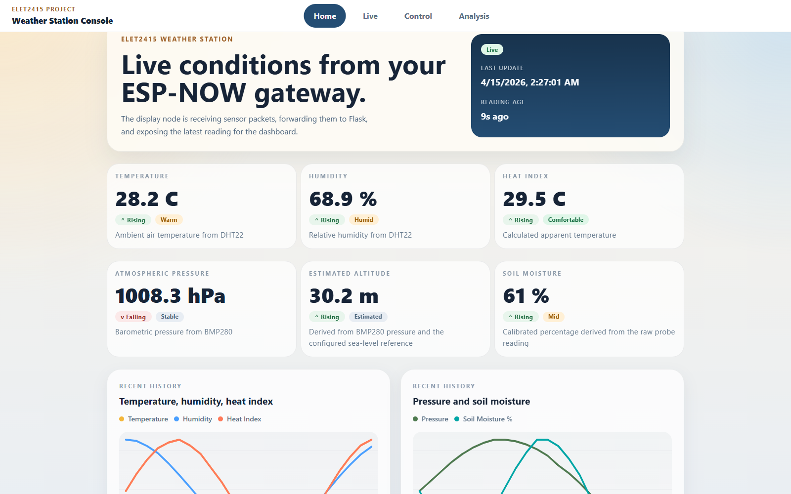
<p>Quick status visibility helps the user understand current conditions immediately.</p>

</div>
<div class="label-card">

### Time-Series Charts

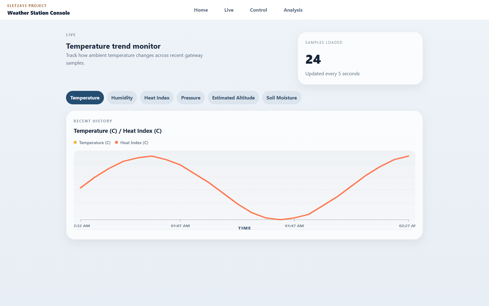
<p>Trend charts answer how readings are changing, not just what they are right now.</p>

</div>
<div class="label-card">

### Analysis Views

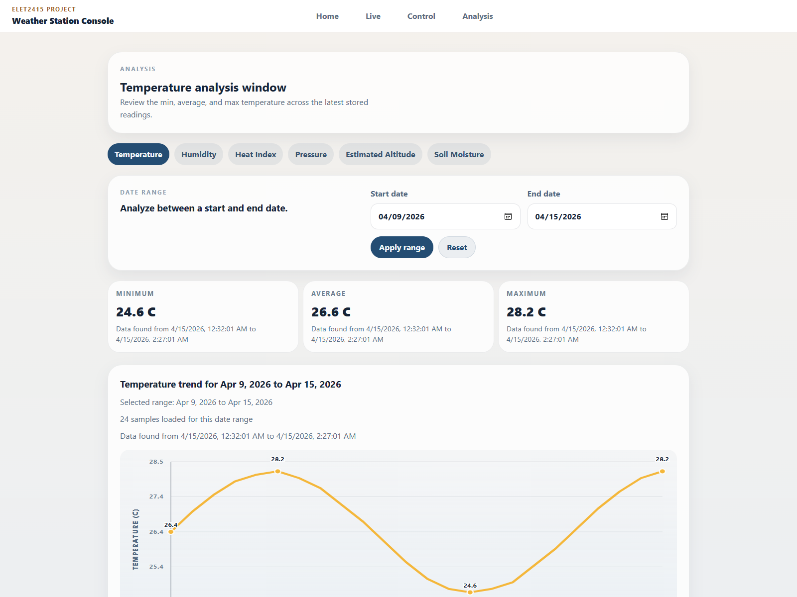
<p>Historical analysis gives the system value for review, planning, and decisions.</p>

</div>
</div>

---

# Engineering Challenges And Solutions

| Challenge | Solution |
| --- | --- |
| Sensor noise and unstable values | validation ranges + smoothing |
| DHT22 or BMP280 read failures | retry logic + fallback to last valid values |
| Soil sensor interpretation | calibrated relative percentage instead of claiming absolute moisture |
| ESP-NOW communication reliability | fixed channel alignment and freshness tracking |
| Stale wireless data | packet-age status shown on the display and dashboard |

---

# Results And Demonstration Value

<div class="gallery-quad">
<div>

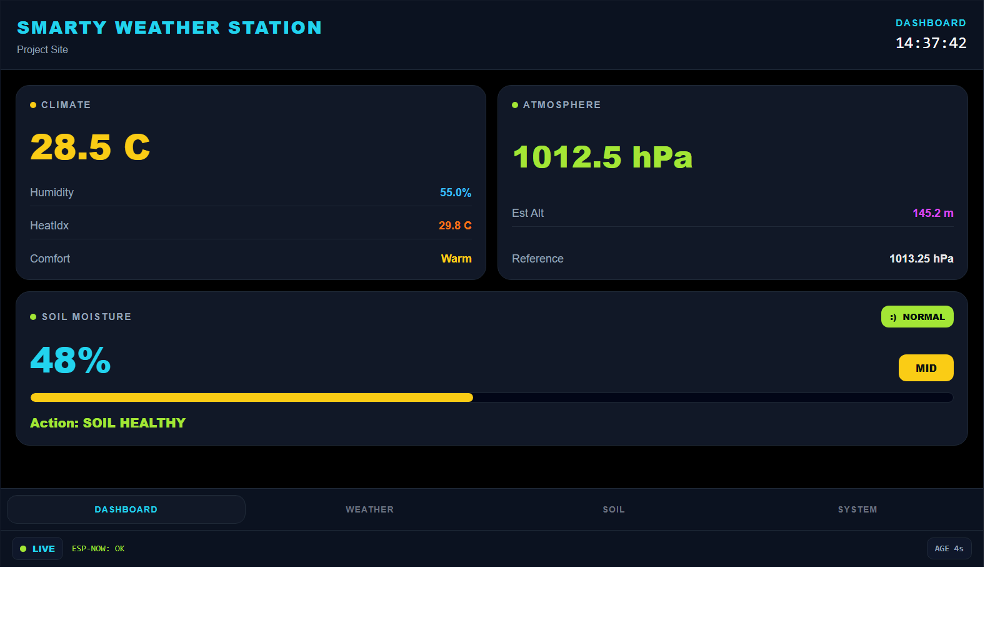
<p>Local display gives immediate on-site visibility.</p>

</div>
<div>

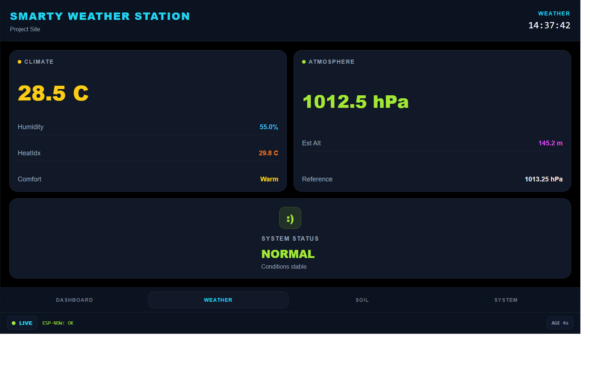
<p>The weather screen highlights climate and atmosphere values.</p>

</div>
<div>

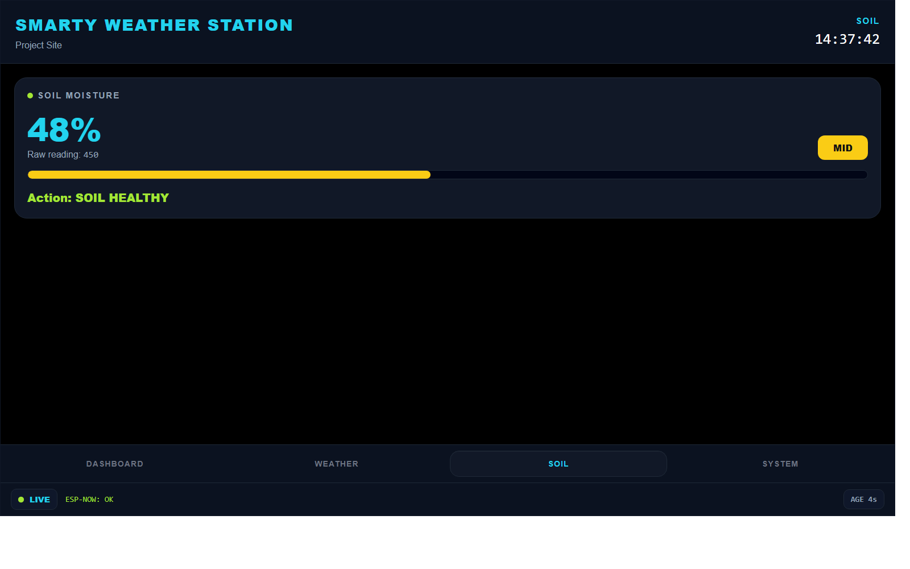
<p>The soil screen turns readings into clear watering guidance.</p>

</div>
<div>

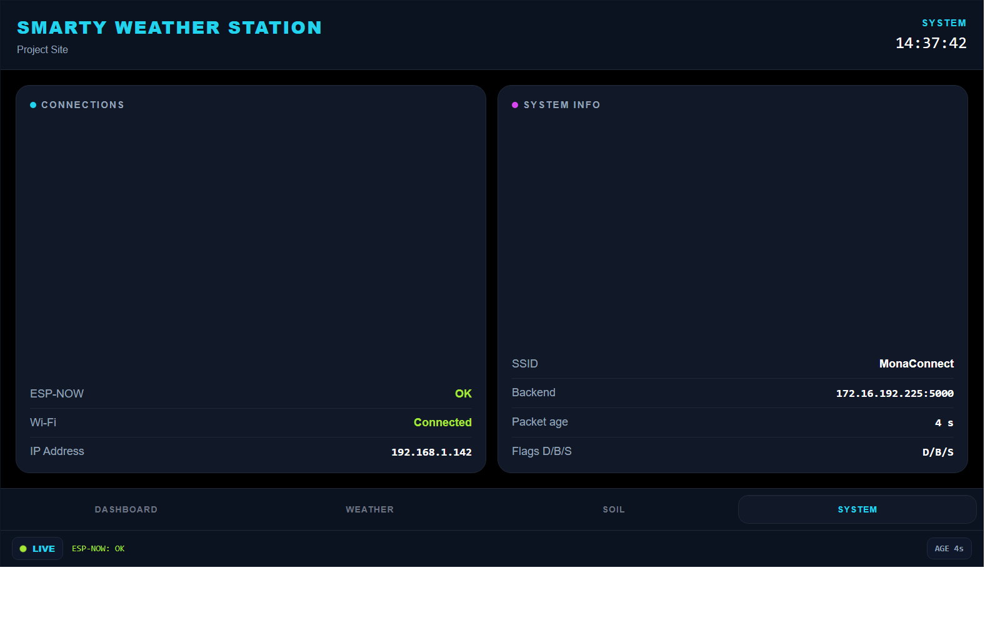
<p>The system screen exposes ESP-NOW, Wi-Fi, and health-state information.</p>

</div>
</div>

---

# Use Cases And Product Value

<div class="split">
<div>

- greenhouse and plant monitoring
- classroom IoT demonstrations
- small-site environmental tracking
- smart agriculture prototypes

**Why it matters**

- combines local awareness with remote visibility
- turns raw readings into actionable information
- creates a base for future automation

</div>
<div>

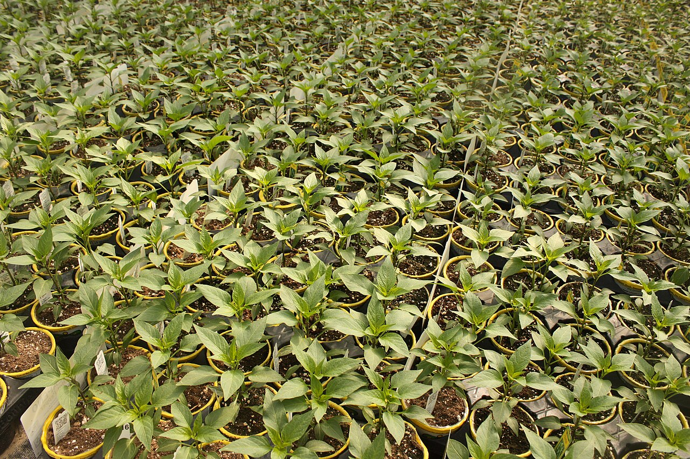

</div>
</div>

---

# Future Roadmap

- Add mobile notifications for critical conditions
- Deploy the backend to a cloud host for wider access
- Improve enclosure and outdoor protection
- Add actuator control for irrigation or smart-environment automation
- Extend analytics with prediction or alert rules

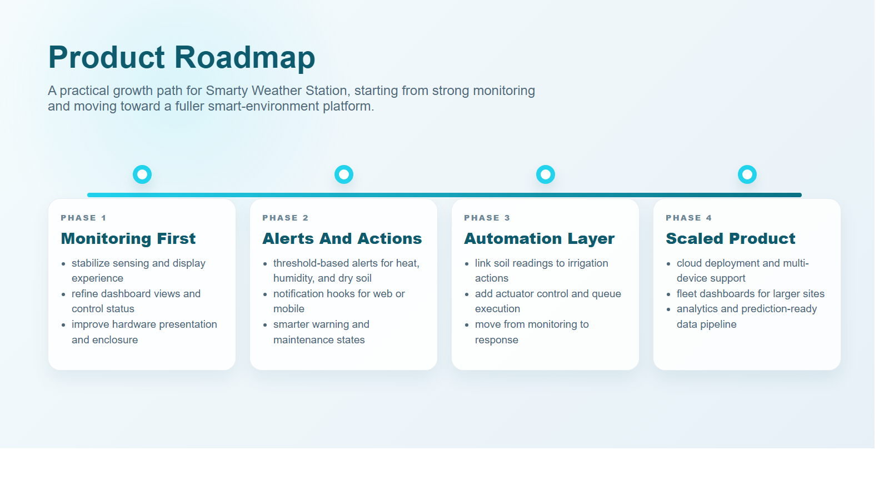

---

# Conclusion

- Smarty Weather Station demonstrates a complete IoT pipeline from sensing to visualization
- The project integrates **hardware, wireless communication, backend storage, and frontend analysis**
- Engineering value comes from validation, fallback logic, and clear system status, not just sensor readings

---

# Impact Statement

<div class="impact-box">

- This project shows how a low-cost embedded system can become a practical monitoring platform
- It supports smarter environmental decisions through live data, history, and wireless accessibility
- The design is suitable for extension into agriculture, alerts, and automated control

</div>

<p class="note">The main impact is not just sensing weather data, but making environmental information visible, reliable, and actionable.</p>

---

<!-- _class: center -->

# Thank You
## Questions?
